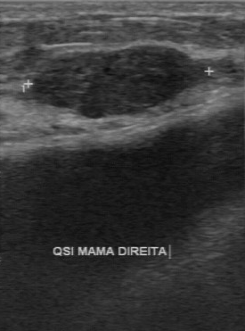
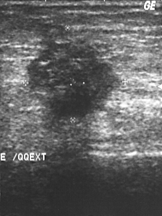

# Inteligência artificial e classificação de imagens médicas
## Daniel Tiezzi

Repositório para a prática: iremos utilizar um banco de dados publicamente disponíveis para aplicar modelos de aprendizado de máquina na classificação de imagens médicas.

Banco de dados: **BUS-BRA: A Breast Ultrasound Dataset for Assessing Computer-aided Diagnosis Systems (source codes)**
Download: [BUSBRA](https://doi.org/10.5281/zenodo.8231412)).

O banco de dados tem as imagens em modo B e foram segmentadas, desta forma temos uma máscara da localização da lesão na imagem:

### Lesão provavelmente benigna




### Lesão provavelmente maligna




Foi feito extração de atributos da região segmentada utilizando [Pyradiomics](https://pyradiomics.readthedocs.io/en/latest/).

Baseado nas informações do dataset, as imagens foram divididas em dois diretórios:

```shell
$ mkdir US
$ mkdir US/Malignant
$ mkdir US/Benign

# Script para separar as imagens em diretórios
$ nano split.sh
##########################################################
#!/bin/bash

INDIR='./Images/'
OUTDIR='./US/'

more bus_data.csv | cut -d ',' -f 1,4 > ids.txt

while read line
do
	id=$(echo $line | cut -d ',' -f 1)
	pathol=$(echo $line | cut -d ',' -f 2)
	if [ $pathol == "malignant" ]
	then
  		echo "cp ${INDIR}${id}.png ${OUTDIR}Malignant/"
	else
  		echo "cp ${INDIR}${id}.png ${OUTDIR}Benign/"
	fi
done < ids.txt
rm ids.txt
#############################################################

## Ctrl+x
## y
# Enter

$ chmod +x split.sh
$ ./split.sh

```

Os atributos mais importantes foram selecionados por regressão logística em [R](https://cran.r-project.org/).

Script para o [Google Colab](https://colab.research.google.com/drive/1AADUoAtzIGMzEMJznfb6XrUtQ8GFAK6D?usp=sharing)

